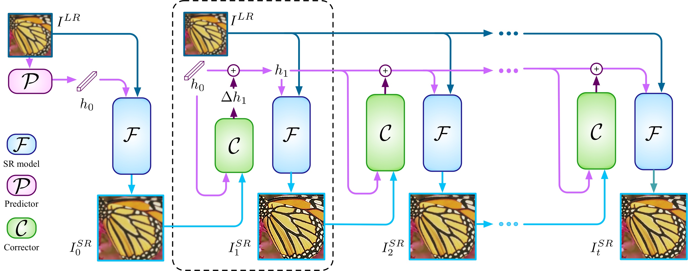
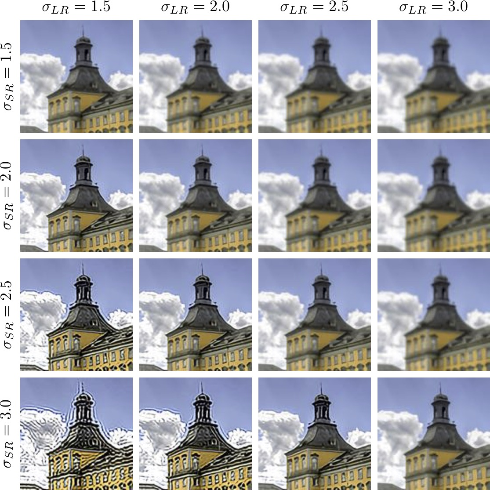

## IKC: Blind Super-Resolution With Iterative Kernel Correction
### [ArXiv](https://arxiv.org/abs/1904.03377) | [BibTex](#citation) | [Project Website](https://www.jasongt.com/projectpages/IKC.html)

Here is the implementation of ['Blind Super-Resolution With Iterative Kernel Correction'](https://www.jasongt.com/projectpages/IKC.html).<br/>
Based on [[BasicSR]](https://github.com/xinntao/BasicSR), [[MMSR]](https://github.com/open-mmlab/mmsr).
About more details, check [BasicSR](https://github.com/xinntao/BasicSR/tree/master/codes).<br/>
Thanks to [Jinjin Gu](https://scholar.google.com/citations?user=uMQ-G-QAAAAJ&hl=en) and [Xintao Wang](https://scholar.google.com/citations?hl=en&user=FQgZpQoAAAAJ).
### Updates
[2019-09-22] IKC v0.1 is modified.<br/>
[2019-09-25] IKC v0.2 is modified. User could use .yaml to change different settings(scale, sigma, etc.)

### Architecture
<p align="center">
  
</p>

### Kernel mismatch
<p align="center">
  
</p>

## Dependencies
- Python 3 (Recommend to use [Anaconda](https://www.anaconda.com/download/#linux))
- [PyTorch >= 1.0](https://pytorch.org/)
- NVIDIA GPU + [CUDA](https://developer.nvidia.com/cuda-downloads)
- Python packages: `pip install numpy opencv-python lmdb pyyaml`
- TensorBoard: 
  - PyTorch >= 1.1: `pip install tb-nightly future`
  - PyTorch == 1.0: `pip install tensorboardX`

## Installation
- Clone this repo:
```bash
git clone https://github.com/yuanjunchai/IKC.git
cd IKC
```
- Install PyTorch and dependencies from http://pytorch.org


## Dataset Preparation
We use [DIV2K](https://data.vision.ee.ethz.ch/cvl/DIV2K/), [Flickr2K](http://cv.snu.ac.kr/research/EDSR/Flickr2K.tar), [Set5](https://uofi.box.com/shared/static/kfahv87nfe8ax910l85dksyl2q212voc.zip), [Set14](https://uofi.box.com/shared/static/igsnfieh4lz68l926l8xbklwsnnk8we9.zip), [Urban100](https://uofi.box.com/shared/static/65upg43jjd0a4cwsiqgl6o6ixube6klm.zip), [BSD100](https://uofi.box.com/shared/static/qgctsplb8txrksm9to9x01zfa4m61ngq.zip) datasets. 
To train a model on the full dataset(DIV2K+Flickr2K, totally 3450 images), download datasets from official websites. 
After download, run [`codes/scripts/generate_mod_LR_bic.py`](codes/scripts/generate_mod_LR_bic.py) to generate LRblur/LR/HR/Bicubic datasets paths and corresponding kernel map. 
```bash
python codes/scripts/generate_mod_LR_bic.py
```
### About data
When train, dataset_GT is used to produce actual LR and corresponding kernel in [`train_IKC.py`](codes/train_IKC.py) and [`train_SFTMD.py`](codes/train_SFTMD.py). Therefore, dataset_LQ is not used.<br/>
When test, the operation is the same as above in [`test_SFTMD.py`](codes/test_SFTMD.py) so as to get kernel maps.<br/>
However, you need to change dataset_LQ in [`test_IKC.py`](codes/test_IKC.py)!!<br/>
Another method is use [`generate_mod_LR_bic.py`](codes/scripts/generate_mod_LR_bic.py).
## Getting Started
### Pretrained model
You could download the pre-trained models from `./checkpoints` directory.<br/>
Remember: change opt['path']['pretrain_model_G'] of the .yaml to the models' path you saved.

### Train
First, train SFTMD network, and then use pretrained SFTMD to train Predictor and Corrector networks iteratively.

1. To train the SFTMD model, change image path of [`codes/options/train/train_SFTMD.yml`](codes/options/train/train_SFTMD.yml), especially dataroot_GT, dataroot_LQ. You could change opt['name'] to save different checkpoint filenames, and change opt['gpu_ids'] to assign specific GPU.
```bash
python codes/train_SFTMD.py -opt_F codes/options/train/train_SFTMD.yml
```

2. To train Predictor and Corrector models, you first should change opt_F['sftmd']['path']['pretrain_model_G'] to the path of pretrained SFTMD checkpoint. Also, dataroot_GT, dataroot_LQ of opt_P, opt_C should be filled with corresponding train&validation data paths.
```bash
python codes/train_IKC.py -opt_F codes/options/train/train_SFTMD.yml -opt_P codes/options/train/train_Predictor.yml -opt_C codes/options/train/train_Corrector.yml
```

### Test
0. At first, you'd better run [`codes/scripts/generate_mod_LR_bic.py`](codes/scripts/generate_mod_LR_bic.py) to generate LRblur/LR/HR/Bicubic datasets paths and corresponding kernel map.
```bash
python codes/scripts/generate_mod_LR_bic.py
```
1. To test SFTMD model, change test datasets paths of [`codes/options/test/test_SFTMD.yml`](codes/options/test/test_SFTMD.yml).
```bash
python codes/test_SFTMD.py -opt_F codes/options/test/test_SFTMD.yml
```

2. To test Predictor and Corrector models, change datasets paths of [`codes/options/test/test_Predictor.yml`](codes/options/test/test_Predictor.yml) and [`codes/options/test/test_Corrector.yml`](codes/options/test/test_Corrector.yml). 
```bash
python codes/test_IKC.py -opt_F codes/options/test/test_SFTMD.yml -opt_P codes/options/test/test_Predictor.yml -opt_C codes/options/test/test_Corrector.yml
```
The 'dataroot_GT' is only used as PSNR calculation. If you'd like to use it in blind-SR, you could set 'dataroot_GT:~' and just use your own LR data.

## Citation
    @InProceedings{gu2019blind,
        author = {Gu, Jinjin and Lu, Hannan and Zuo, Wangmeng and Dong, Chao},
        title = {Blind super-resolution with iterative kernel correction},
        booktitle = {The IEEE Conference on Computer Vision and Pattern Recognition (CVPR)},
        month = {June},
        year = {2019}
    }
